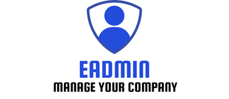

# eAdmin v1.1.0
Aplicación de escritorio para gestionar trabajadores en una empresa.

> [!NOTE]
> Aplicación desarrolada en formación del ciclo de grado superior Desarrollo de Aplicaciones Multiplataforma (DAM).

eAdmin implementa un login que determinará el rol de usuario iniciado, por lo tanto lo que está o no visible dentro de la aplicación. También implementa funcionalidades como:

* Sistema de fichadas para los empleados.
* Sistema de gestión de usuario.
* Sitema de gestión de departamentos.

